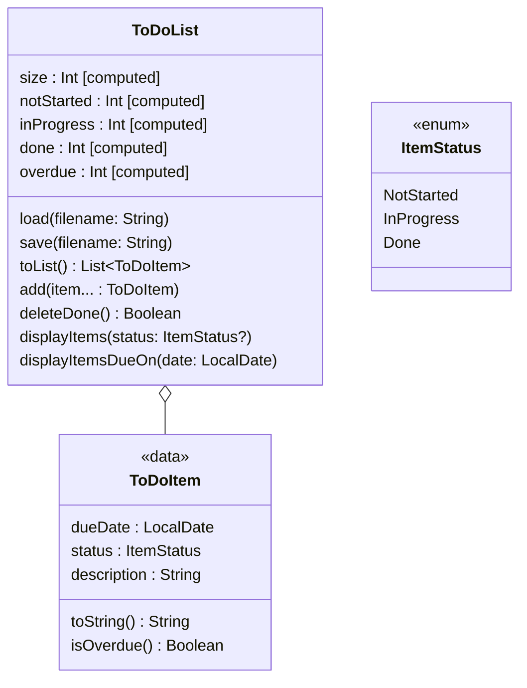

# 'To Do' Lists

Below is a UML diagram showing classes that collectively implement a simple
'To Do' list.

## Discussion

A `ToDoItem` has a due date, a current status and a description of the item.
It overrides `toString()` to provide a string representation including these
three properties, separated by a colon and a space, e.g.,

    2026-10-16: Done: Fix bike puncture

`ToDoItem` also has an `isOverdue()` method that returns `true` if the due
date comes before today's date, otherwise `false`.

A `ToDoList` is an aggregration of `ToDoItem` objects. It has a set of
computed properties that give the size of the list, the number of items with
a status of `NotStarted`, the number of items with a status of `InProgress`,
the number of items with a status of `Done`, and the number of items that
are overdue.

`ToDoList` also provides methods to load a list from a file, and save it to
a file. See `to-do.csv` in `to-do-list/data/` for an example of the required
format.

Invoking the primary constructor of `ToDoList` gives you an empty list,
to which you can add items using the `add()` method. This accepts a variable
number of `ToDoItem` objects as its argument (minimum of 1).

The `deleteDone()` method of `ToDoList` removes any items with a status of
`Done`. It returns `true` if any items were actually removed, otherwise `false`.

Finally, there are two methods for displaying list items on standard output.
`displayItems()` can be called with one of the `ItemStatus` enum values or
`null` as an argument, `null` being the default. If the argument is `null`,
it will print all of the items in the list. on separate lines; otherwise it
will print only the items that have the specified status.

`displayItemsDueOn()` takes a `LocalDate` object as its sole argument and
prints details of all the items whose due date matches the given date.

If there is anything you don't understand about the diagram or the discussion
above, ask for help in one of your timetabled lab sessions.

## Your Task

We have provided incomplete code for the classes in the diagram above, along
with a small demo program, in subdirectory `to-do-list/src`. **Spend some
time examining these source files carefully.** If there is anything you don't
understand, please ask for help in one of your timetabled lab sessions.

The first step is to run the tests for these classes, with

    ./kotlin test -m to-do-list

and

    python check.py

You will notice a number of failures. This is because some of features of
`ToDoList` are stubs rather than proper implementations. The stubbed
features are

- `notStarted` computed property
- `inProgress` computed property
- `done` computed property
- `overdue` computed property
- `load()` method
- `deleteDone()` method
- `displayItems()` method
- `displayItemsDueOn()` method

Edit `to-do-list/src/ToDoList.kt` and replace these stubs with the correct
implementations. When all of the tests pass, you will have completed this
part of the assignment successfully.

**Note that several of these stubs can be implemented using a single line
of code**, so you are not being asked to do a huge amount of work here!

You will definitely find the discussion of [Lambdas & Collections][sec83]
useful if you are seeking a concise solution.

[sec83]: https://comp2850.github.io/kotlin-guide/lambda/collections
