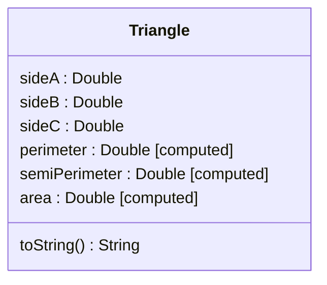

# Triangles

Recycle the code from your Week 3 solution to implement the class shown
in the UML diagram below.

Your `Triangle` class must be implemented in `triangles/src/Triangle.kt`.
It should have a primary constructor that initializes three stored properties
representing a triangle's sides, with the names and types indicated by the
diagram. Each should be defined as a `val`.

Your `Triangle` class should also have an initializer block that checks the
values provided for the triangle's sides, throwing an exception if they do
not collectively represent a valid triangle.

Your `Triangle` class should have three computed properties, representing
a triangle's perimeter, semi-perimeter and area.

Finally, your `Triangle` class should override `toString()` so that triangles
have an appropriate string representation. For example, when `sideA` is 3.0,
`sideB` is 4.0 and `sideC` is 5.0, the corresponding string representation
should look *exactly* like this:

    Triangle(3.0, 4.0, 5.0)

Test your implementation of the class by running the tests, with

    ./kotlin test -m triangles

If all 15 of the tests pass, you have completed this part of the assignment
successfully.
