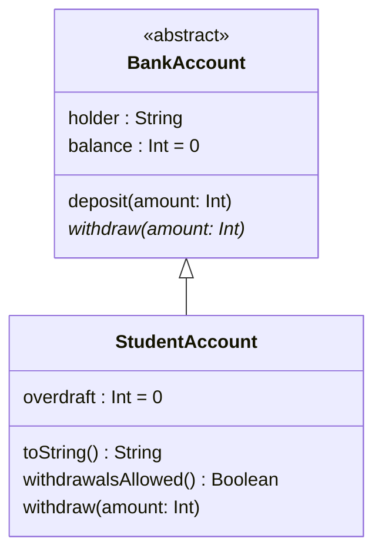

# Portfolio: Week 5

## Relevant Preparation

This work draws on Sections 12 to 16 of the [Kotlin Programming Guide][guide].

Subsections [15.2][sec152] and [16.2][sec162] are of particular relevance.
Make sure you've completed the tasks in those subsections before you begin.

## Instructions

Consider the classes in the following UML diagram:

We have provided the `BankAccount` class for you, in `src/banking/comp2850`.
It's similar to the one used in Task 15.2.3, except that it is an abstract
class and it is defined in the `comp2850.banking` package.

Your task is to implement `StudentAccount`, also in the `comp2850.banking`
package, following the guidance provided in the UML diagram and in the
notes below.

We have provided tests for the class. You can run them with

    ./kotlin test

You will need to create a minimal implementation of `StudentAccount` first,
defining the `overdraft` property and providing stub implementations of
`withdraw()` and `withdrawalsAllowed()`. This will be sufficient for the
tests to compile and run.

After you have the tests running, you can concentrate on finishing the
implementation so that it complies with the UML diagram and the notes below.

**For a Pass on this assignment, all of the provided tests must pass.**

### Notes

- `StudentAccount` should provide a custom setter for `overdraft`, which
  throws `IllegalArgumentException` on any attempt to set an overdraft
  outside the range 0 to 100.

- The default value of `overdraft` should be 0.

- In a `StudentAccount`, `balance` is allowed to become negative, but only
  up to the limit specified by the `overdraft` property. For example, if
  `overdraft` has its maximum allowed value of 100, `balance` will be allowed
  to be as low as -100, but cannot fall below that value.

- `withdraw()` should throw `IllegalArgumentException` if the specified
  amount is not greater than 0, with the _exact_ message

      Withdrawal amount must be greater than 0

- `withdraw()` should allow withdrawals only if the specified amount would
  not lower `balance` below the limit specified by `overdraft`. If this
  requirement is not satisified, it should throw `IllegalArgumentException`,
  with the _exact_ message

      Insufficient funds for withdrawal

- `withdrawalsAllowed()` should return `true` if further withdrawals are
  possible, `false` otherwise.

- `toString()` should return a string representation that includes holder,
  balance and overdraft. It should have this format:

      Account for Sarah, balance = 120 (overdraft = 50)

[guide]: https://comp2850.github.io/kotlin-guide/
[sec152]: https://comp2850.github.io/kotlin-guide/inherit/subclasses
[sec162]: https://comp2850.github.io/kotlin-guide/abstract/abs-kotlin
